# Chord Pico - Polaris Chord Mini Controller
[点这里可以切换到中文版](README_CN.md)

Features:
* World's first Polaris Chord controller.
* Almost all parts are 3D printed.
* Hall effect keys with configurable travel distance.
* RGB key lights with HID light support.
* Fader sensors are arcade accurate.
* All open source.

Thanks to the many generous individuals and companies who made their tools or materials free or open source (KiCad, OnShape, InkScape, Raspberry things).

Special thanks to community projects and developers. And also these projects:
* RP_Silicon_KiCad: https://github.com/HeadBoffin/RP_Silicon_KiCad
* Type-C: https://github.com/ai03-2725/Type-C.pretty

## About the License
It's CC-NC. So DIY for yourself and your friends, don't make money from it. Plagiarism, especially without crediting the original author, is not acceptable. Please note that pooling orders and group buying for raw materials are acceptable. Selling off any leftover components without profit is also acceptable.

If you're interested in buying from me, or in commercial use, please contact me (Discord, QQ group, Goofish).
* My Discord Invitation: https://discord.gg/M8f2PPQFEA
* QQ Group: 854535476
* Goofish: whowe12345

## My Other Projects
You can check out my other cool projects.

               

* Popn Pico: https://github.com/whowechina/popn_pico
* IIDX Pico: https://github.com/whowechina/iidx_pico
* IIDX Teeny: https://github.com/whowechina/iidx_teeny
* Chu Pico: https://github.com/whowechina/chu_pico
* Mai Pico: https://github.com/whowechina/mai_pico
* Diva Pico: https://github.com/whowechina/diva_pico
* AIC Pico: https://github.com/whowechina/aic_pico
* Groove Pico: https://github.com/whowechina/groove_pico
* Geki Pico: https://github.com/whowechina/geki_pico
* Musec Pico: https://github.com/whowechina/musec_pico
* Ju Pico: https://github.com/whowechina/ju_pico
* Bishi Pico: https://github.com/whowechina/bishi_pico
* Nos Pico: https://github.com/whowechina/nos_pico
* Voltex Pico: https://github.com/whowechina/voltex_pico
* Chord Pico: https://github.com/whowechina/chord_pico

## **Disclaimer** ##
I made this project in my personal time without any sponsorship. I will continue to improve the project. I have done my best to ensure that everything is accurate and functional, but there's always a chance that mistakes may occur. I cannot be held responsible for any loss of time or money that may result from using this open source project. Thank you for your understanding.

## HOW TO BUILD
### PCB and Components
* Go to JLCPCB or any PCB vendor you like, and place an order with the gerber zip files (latest `Production\PCB\chord_pico_xxx.zip`), regular FR-4 board, black color, **1.6mm** thickness.

* 1x Raspberry Pi Pico or pin-to-pin compatible clones, those with type-C port are strongly recommended.  
  https://www.raspberrypi.com/products/raspberry-pi-pico
* 1x USB Type-C socket (918-418K2023S40001 or KH-TYPE-C-16P)
* 1x ADG706BRUZ (28-TSSOP) 16 to 1 analog multiplexer (U2).  
  https://www.analog.com/en/products/adg706.html
* 12x SS49E (SOT23) linear Hall effect sensors (H1 to H12).
* 10x ITR1502SR40A/TR8 reflective photointerrupters (IR1 to IR10).  
  https://www.lcsc.com/product-detail/C183793.html
* 1x TPS7A2042PDBVR (4.2V) or LP5907MFX-4.5 (4.5V) LDO (SOT23-5), (U7).  
  https://www.ti.com/product/TPS7A20/part-details/TPS7A2042PDBVR
* 1x LM4040 3.0V Shunt Voltage Reference, in SOT23-3 (U6). There're many models; make sure it's 3.0V and in an SOT23-3 package.
* 1x Zener diode 3.0 or 3.3V, in SOD-123F (D1).  
* 42x WS2812B-3528 RGB LEDs (D1 to D42). D1 to D12 and D35 to D38 are mandatory; others are for better lighting.
* 20x to 30x 0603 0.1uF (0.1~1uF all fine) capacitors. CC1 to CC3 are mandatory; others are optional (see notes below).
* 3x 0603 5.1kohm resistors, 2 for USB (R1, R2) and 1 for signal divider (R4).
* 1x 0603 2kohm resistor for signal divider (R3).
* 10x 0603 200ohm resistors as photointerrupter current limiters (R5, R7, R9, ... R23).
* 10x 0603 33kohm resistors as photointerrupter pull-downs (R6, R8, R10, ... R24).
* 2x ALPS SKHHLWA010 6\*6\*7mm or compatible tactile switches (SW1, SW2).  
  https://tech.alpsalpine.com/e/products/detail/SKHHLWA010/

* This is what the board looks like after soldering.  
  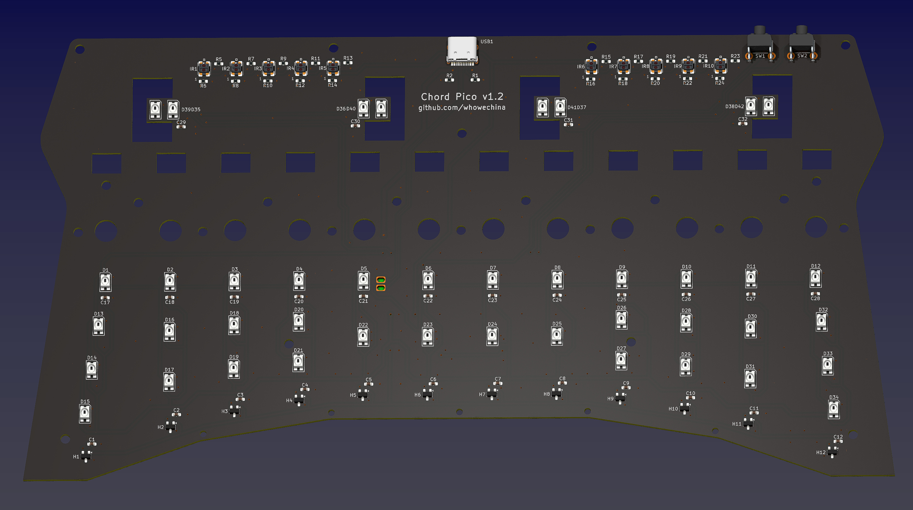  
  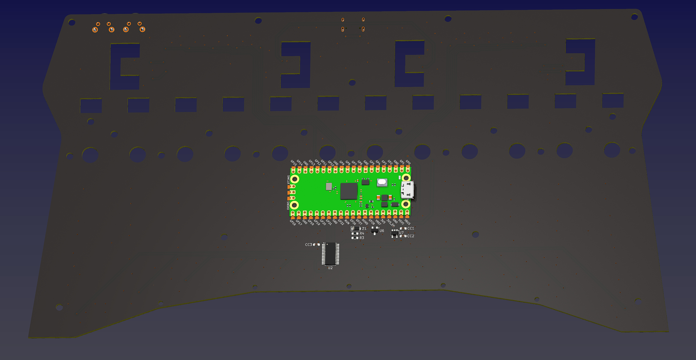

### Notes
1. Be careful of 2 USB pins (holes) for the Pi Pico. It's a common oversight to either forget to solder them or to leave air bubbles during the process. To avoid this, solder slowly from only one side of the hole.  
   
2. There are many capacitors for decoupling. You don't need to solder them all. You can solder only some of them; just distribute them evenly.

### Test the PCB
* You can test the PCB now, put the firmware in.
* Most likely all key LEDs will light up and flash.
* Left fader LEDs will light up green, right fader LEDs will light up pink.
* Chord Pico should be recognized as a USB HID device. Here's the test page.  
  https://greggman.github.io/html5-gamepad-test/
* Use a terminal tool to connect to Chord Pico's command line interface.
  https://googlechromelabs.github.io/serial-terminal/
* Use `debug hall` to toggle hall effect sensor debug mode. When it's on, you can see the real-time sensor values. Use a small magnet to test them one by one. The value should change significantly when a magnet is close to the corresponding sensor. If you notice strange values, check the soldering of the muxiplexer and the corresponding hall effect sensor.
* Use `debug fader` to toggle fader sensor debug mode. When it's on, you can see real-time fader sensor status. You can use a white object (e.g. paper), waving it 5mm above the sensor to see the response.
* Only when PCB is fully functional, you can proceed to the assembly.

### 3D Printing
#### Printing parameters  
* PLA or PETG.
* Layer height: 0.2mm
* Support: No, unless explicitly mentioned.
* Files are always in millimeter units, not inches.
* Parts can fit on a 256mm\*256mm bed, you may need to rotate them to fit.

#### Parts
* All files are in `Production\3DPrint` folder.
* Keys: `Key Combo - All Keys`, clear or transparent.
* Rear Base: `Chord Pico - Rear.stl`, black. Enable support and use support material to have better screw holes.
* Front Base: `Chord Pico - Front.stl`, black. Enable support and use support material to have better screw holes.
* Panel: `Chord Pico - Panel Combo.3mf`, a multi-color system is highly recommended, make the "Panel White Layer" white, others black. Print upside down.
* Brim (Key Stopper): `Chord Pico - Brim Insert.stl` is recommended, but if you can't use heat-set inserts, use `Chord Pico - Brim.stl` instead (see notes below). Use black filament. Print upside down.
* 2x Fader Slider: `Slider PTFE.stl` is recommended, but if you can't find proper PTFE tube, use `Slider Thruhole.stl` instead (see notes below). Must be white.  
* 2x Fader Seal: `Slider Seal.stl`, white.
* 4x Rail Fixers: `Chord Pico - Rail Fixer.stl`, color doesn't matter.
* 2x Fader Knobs: `Fader - Knob.stl`, one in green, one in red.

#### Notes
1. For the Brim (Key Stopper), heat-set inserts are recommended; they provide a better solution than self-tapping threads. But if you can't find them or don't have the tools, you can use self-tapping version instead, just be careful when screwing, do it slowly and don't overtighten.
2. For the Fader Slider, a PTFE tube is recommended for smoother feel. If you can't find proper PTFE tube, you can use the through-hole version.

### Assembly
#### Other components needed
* 13x M3\*6mm screws for the PCB to the front and rear base.
* 7x M3\*12mm screws for the panel to the rear base.
* 7x M2\*10mm screws for the front base to the brim.
* 24x M2\*7mm or M2\*6mm screws for the slider.
* 2x M2\*16~18mm for the knob.

* 7x M2\*3mm\*3mm (outer diameter\*height) heat-set inserts, if you use them for the brim.

* 1x 2mm\*240mm (diameter\*length) steel shaft for the keys, if you can't find one, you can use 3x 2mm\*80mm or 4x 4mm\*60mm, or even 6x 2mm\*40mm instead.

* 4x 2mm\*70mm (diameter\*length) steel shafts for the fader rails.

* 12x 0.4\*5\*10\*6N (0.4mm wire diameter, 5mm outer diameter, 10mm free length, 6 turns) springs.
* 12x 3mm\*2mm (diameter\*height) axial magnetized cylinder magnets.
* Some 2.2mm\*4mm or 2.3mm\*4mm (inner diameter\*outer diameter) PTFE tubes.
* Some white silicone adhesive, such as K-704 silicone industrial adhesive.
* Some damping grease, low viscosity, such as Runsai's type-2.

* 4x 0.3mm\*5mm\*15mm (wire diameter\*outer diameter\*length) close-wound tension springs, for the faders.

* Some 0.5~0.8mm thick self-adhesive foam tape (Poron or EVA) for damping.

* Some 10mm\*2mm or 10mm\*2mm (diameter\*height) silicone self-adhesive anti-slip pads.

#### Steps
Please note that the design may change in the future, but the assembly steps will remain the same. So ignore minor differences in some details.

1. Use the M3\*6mm screws to fix the PCB to the front and rear base part.  
   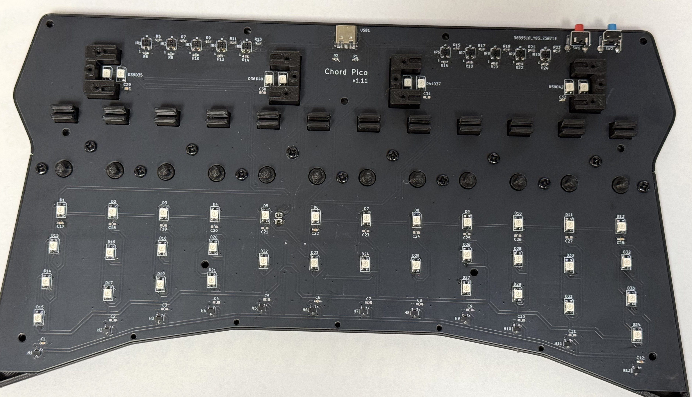

2. Insert the magnets into the slots at the front of the keys and secure them with adhesive (such as white RTV 704 silicone glue).
3. Install the keys. Use the steel shaft to go through all keys, and then embed the steel shaft into the hinge sockets in the rear base.  
   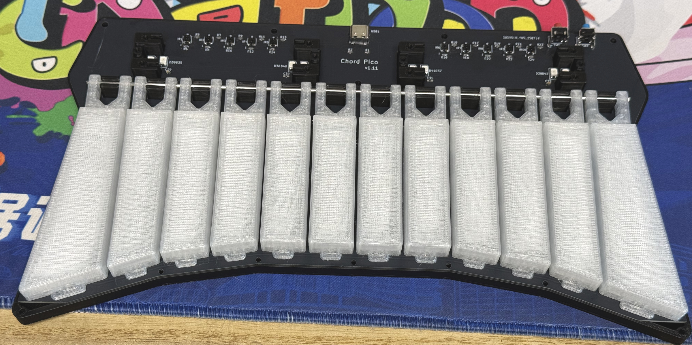

4. Cut some pieces of PTFE tube and embed them into the slider. They provide smoothness while sliding the faders. If you do not use PTFE tube, please use the through-hole slider and skip this step.  
   

5. Insert the close-wound tension springs into the slider, then use M2 screws to secure the slider seal to the slider.
   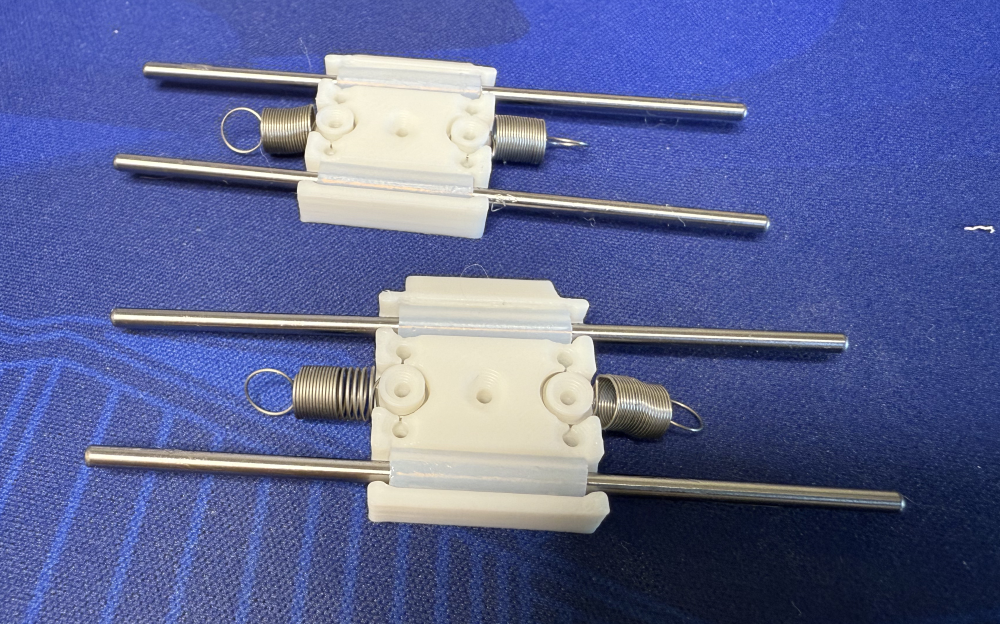 

6. While the steel shafts are inserted, put the slider combo into the rear base. Then hook the springs to the base and finally use M2 screws and the rail fixers to secure the slider combo. You can apply a little bit of damping grease to the steel shafts to make the slider less bouncy.  
   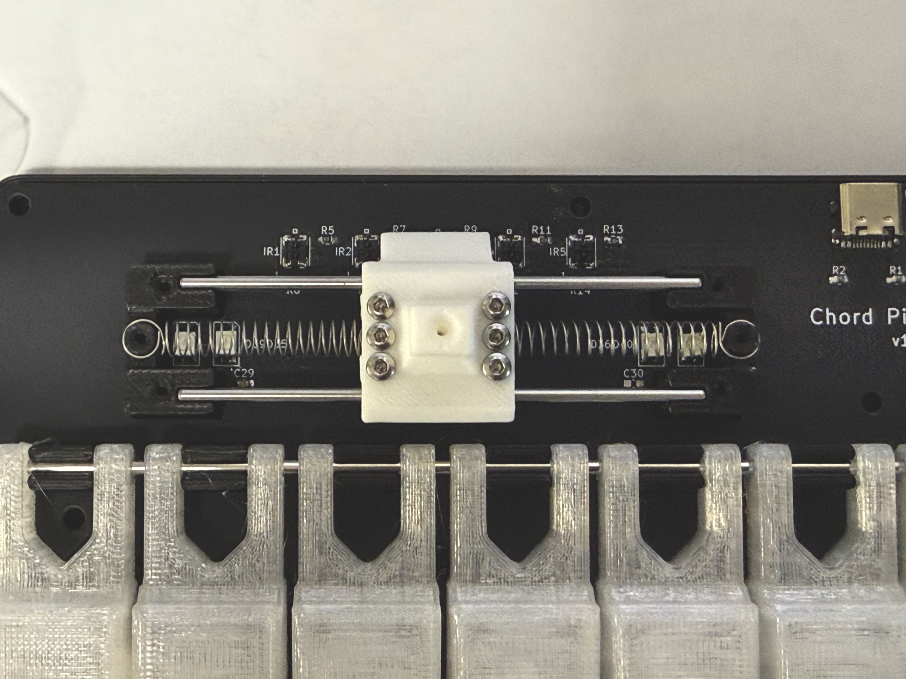 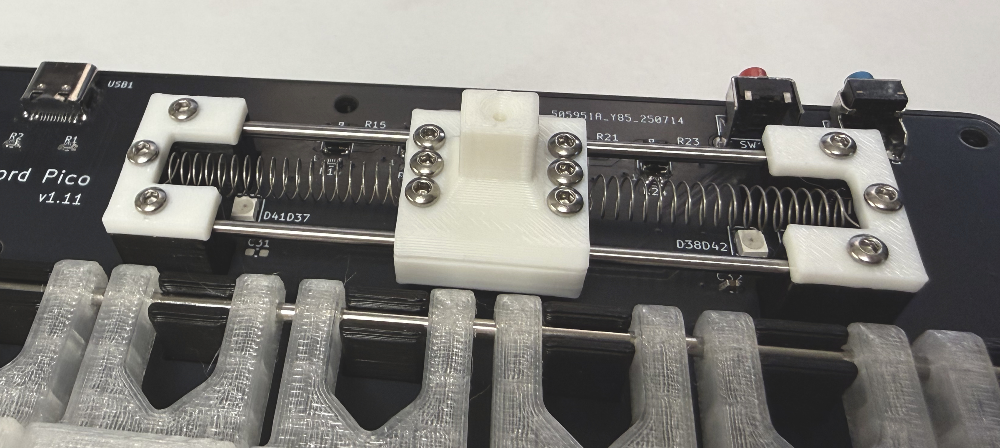

7. Install the springs for the keys.  
   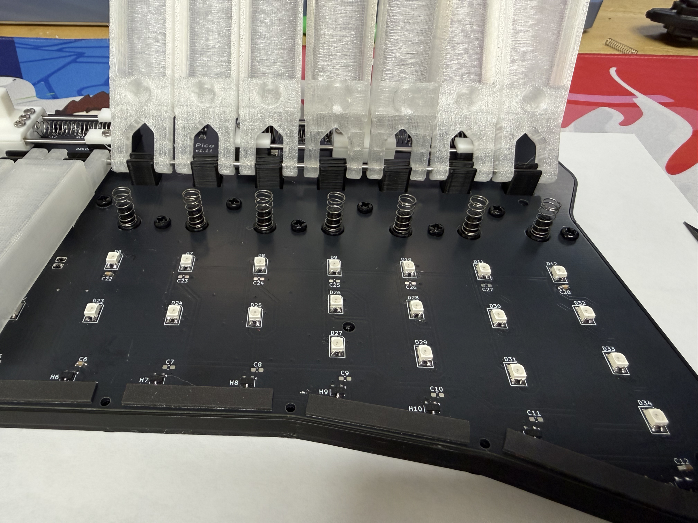

8. Now do another test. Power on and calibrate the keys. Keys and faders should work properly. If everything is fine, proceed to the next step.

9. Optional but highly recommended: use some form tape to dampen the key noise. You need to stick the foam tape to the PCB (right below the Hall sensors) and the key stopper (brim) part. They reduce the key down and key up noise significantly.  
   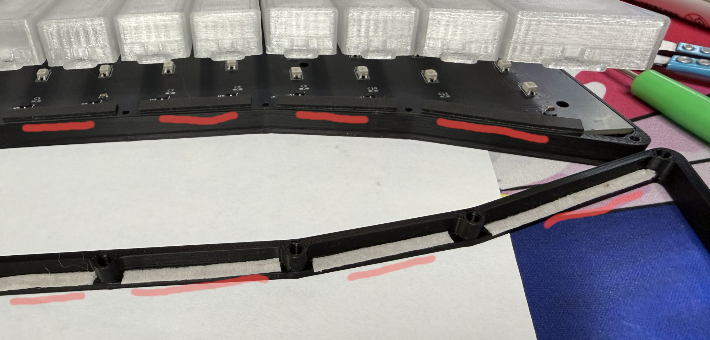

10. If the area of the panel above the sensors is printed with white material, use a black marker to color it. This helps reduce the risk of sensor interference.  
   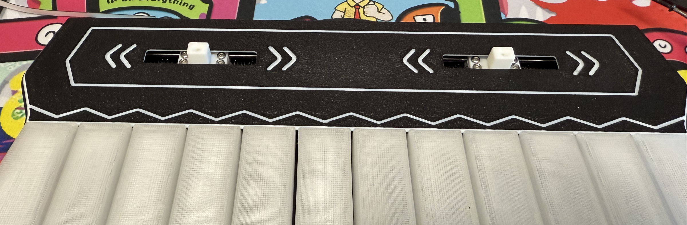

11. Put the panel onto the base. The two auxiliary switches can interfere with the panel during installation, so move the right slider to the left and gently flex the panel to snap it into place. Then use the M3\*12mm screws to secure the panel to the base. When screwing, the panel will be pushed away from the base a little bit. You need to fully unscrew and then re-screw while pressing the panel down to make sure it's fully seated.  
    

12. You may have another test. Power on and calibrate. Make sure everything still works.

13. Install the knobs. The left is green and the right one is red. Secure them using the longest M2 screws.  
    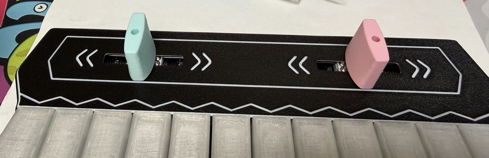

14. Install the brim (key stopper) part. If you use heat-set inserts, use the proper tools to install them into the brim (key stopper) first. Use M2\*10mm screws to secure the brim to the front base.  
    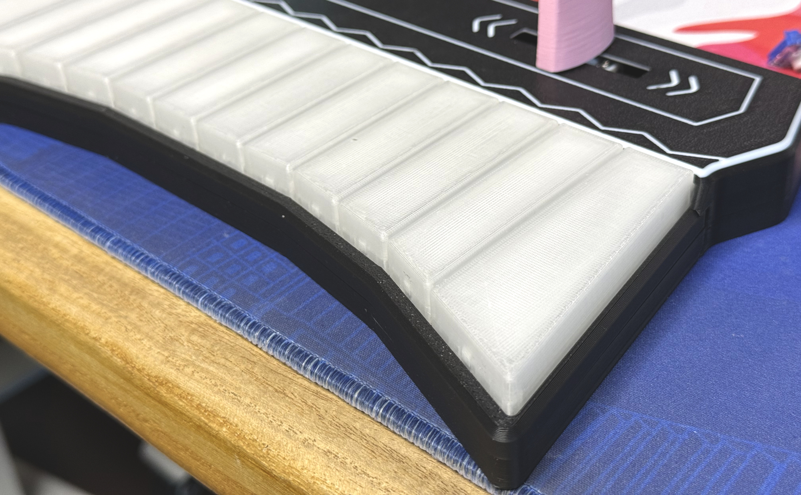

15. Attach the anti-slip pads to the bottom of the rear base.

16. Power on and recalibrate the keys.

17. Enjoy!  
    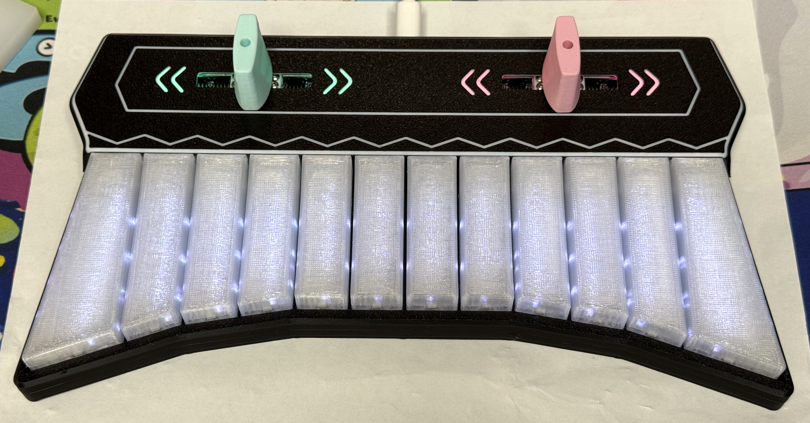

### Firmware
* UF2 file is in `Production\Firmware` folder.
* For the new build, hold the BOOTSEL button while connecting the USB to a PC, a disk named "RPI-RP2" will appear. Drag the UF2 firmware binary file into it. Note that there is a small hole on the bottom side of the controller, aligned with the BOOTSEL button.
* If it's already running the firmware, you can either use `update` in the command line or hold down the two auxiliary switches while connecting to USB to enter update mode.
* To access the command line, you can use this Web Serial Terminal to connect to the controller's command line port. (Note: "?" is for help)  
  https://googlechromelabs.github.io/serial-terminal/

### Usage
* Just plug and play.
* Keys are mapped to HID buttons.
* Faders are mapped to the HID axes X and Y.
* Use the `calibrate` command to calibrate the Hall effect keys.
* Use the `trigger` command to set the trigger and reset distances.

## CAD Source File
I'm using OnShape free subscription. It's powerful, but it can't archive original designs locally, so I can only share the link here. STL/DXF/DWG files are exported from this online document.  
  https://cad.onshape.com/documents/6bb6f9e65a79e122747d4a2d/w/1074c535f59b2616ddc9d820/e/61a1d98d42199565d2d1adba
